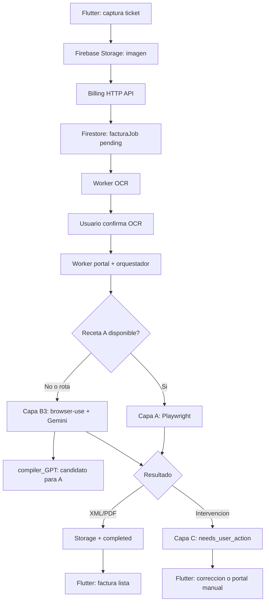

# Architecture

## Piezas principales



## Regla de oro

Flutter no automatiza portales.

Flutter solo:

- Sube ticket.
- Llama la API para crear el job y mandar comandos.
- Consulta el estado o escucha su documento propio.
- Muestra resultado.

El backend:

- Ejecuta OCR.
- Decide ruta.
- Corre Capa A o B3.
- Aprende recetas compartidas.
- Descarga CFDI.
- Actualiza estado.

La API no ejecuta automatizacion dentro de la peticion. Solo autentica, valida y
encola; los workers procesan asincronamente con leases y heartbeat.

## Estados del job

```txt
pending
ocr_processing
ocr_review_required
portal_processing
capa_c_preparing
needs_user_action
retry_scheduled
completed
resolved
failed
cancelled
expired
```

## Capas de ejecucion

### Capa A: Templates

Ruta determinista para portales conocidos. Cada portal tiene una receta JSON.

### Capa B: Agente IA

La implementacion activa es B3 con `browser-use` y Gemini. Se usa para portales
desconocidos, flujos dinamicos o recetas rotas. Sus corridas exitosas pasan por
`compiler_GPT` y replay antes de convertirse en recetas reutilizables de A.

### Capa C: Fallback

Cuando no se puede automatizar, devuelve una accion tipada: corregir OCR/datos,
resolver CAPTCHA, iniciar sesion o abrir el portal manualmente. C no vuelve a
ejecutar IA.

## Contrato inicial de `facturaJob`

```json
{
  "id": "job_demo_001",
  "uid": "demo_user",
  "ticketFileUrl": "mock://ticket.jpg",
  "rfcReceptor": "XAXX010101000",
  "rfcEmisor": null,
  "folio": null,
  "fecha": null,
  "monto": null,
  "status": "pending",
  "statusMessage": "Ticket recibido",
  "resultXmlUrl": null,
  "resultPdfUrl": null,
  "error": null,
  "createdAt": "2026-05-12T00:00:00.000Z",
  "updatedAt": "2026-05-12T00:00:00.000Z"
}
```

## Firestore

Ruta inicial:

```txt
EasySat/app/users/{uid}/facturaJobs/{jobId}
```

El worker busca trabajos pendientes con:

```txt
collectionGroup("facturaJobs").where("status", "==", "pending").limit(1)
```

Esto permite procesar jobs de cualquier usuario. La frontera recomendada para
Flutter es `POST /v1/billing/jobs`; el acceso Firestore queda como implementacion
interna y canal opcional de tiempo real.

Los workers se separan por carril:

```txt
ocr       concurrencia alta, Vision y confirmacion
portal    concurrencia baja, A/B3 y navegadores
capa_c    sesiones asistidas por el usuario
```

Durante desarrollo local se puede usar una ruta directa para evitar indices de collection group:

```txt
FIRESTORE_WORKER_UID=demo_user
EasySat/app/users/demo_user/facturaJobs
```

Importante: el backend usa Firebase Admin SDK. No depende de las reglas cliente de Firestore, pero las credenciales de servidor deben protegerse y no subirse al repo.
