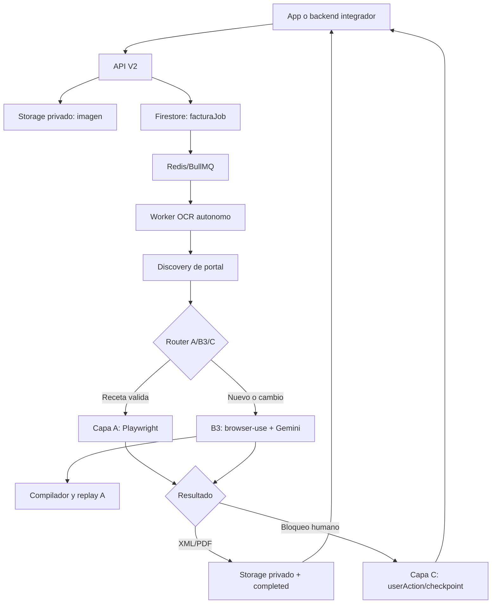

# Arquitectura de facturacion de tickets

## Objetivo

El sistema recibe una foto de ticket y un perfil fiscal ya registrado por la
aplicacion integradora. Ejecuta la facturacion fuera de la app cliente y
devuelve un CFDI sin bloquear la pantalla del usuario.



## API y jobs

`POST /v2/billing/jobs` no ejecuta un navegador dentro de la peticion. Hace
cuatro cosas cortas: autentica, valida el perfil fiscal, guarda la imagen y
crea un job idempotente. Publica una senal de trabajo; si Redis no esta
disponible, el worker puede recuperar jobs por sondeo de Firestore.

El cliente solo necesita guardar `jobId` y consultar su estado. No necesita
conocer Firestore interno ni compartir su proyecto Firebase con AppSat.

Rutas internas de Firestore, configurables por entorno:

```text
{FIRESTORE_ROOT_COLLECTION}/{FIRESTORE_ROOT_DOCUMENT}/users/{uid}/facturaJobs/{jobId}
{FIRESTORE_ROOT_COLLECTION}/{FIRESTORE_ROOT_DOCUMENT}/users/{uid}/billingJobCommands/{commandId}
```

Los valores de ejemplo son `AppSat/app/...`; un despliegue puede elegir otros
sin cambiar el contrato HTTP.

## Carriles de trabajo

| Carril | Concurrencia inicial | Trabajo |
| --- | --- | --- |
| OCR | 4 | Descarga imagen, OCR, QR, normalizacion y candidatos. |
| Portal | 1 por proceso y limite por portal | Discovery, Capa A, B3, descarga y validacion CFDI. |
| Capa C | 2 | Prepara handoff/checkpoint y atiende comandos de reanudacion. |

Redis/BullMQ es el mecanismo recomendado para varios contenedores. Firestore
leases y heartbeats impiden que dos workers reclamen el mismo job. El limitador
por portal usa Redis en produccion para que varias instancias no golpeen la
misma pagina a la vez.

## OCR y discovery autonomos

El worker OCR usa Google Vision como motor base. Antes de pasar al portal:

1. prueba normalizadores y extraccion orientada a ticket;
2. lee QR cuando existe y lo prioriza sobre texto ambiguo;
3. construye candidatos para RFC, folio, codigo, fecha, monto, sucursal y
   datos especificos como `permisoCre`;
4. puede usar Gemini Vision como enriquecimiento configurable;
5. descarta resultados que no tengan datos indispensables o que no superen
   los chequeos de consistencia.

V2 no pide confirmar OCR entre pasos. Si no hay una combinacion segura, el job
termina con `ocr_unresolved`; no intenta facturar por aproximacion.

Discovery ordena las fuentes asi: QR del ticket, URL visible, directorio de
URLs verificado, recetas conocidas y busqueda de respaldo por emisor. La URL se
valida antes de abrirla para evitar destinos privados o no permitidos.

## Router de capas

La politica central siempre toma una de estas decisiones: `run_a`, `run_b3`,
`go_c`, `resolved` o `retry`.

### Capa A

Capa A ejecuta recetas versionadas de portal con Playwright. Es preferida
porque es rapida, barata y repetible. Antes de emitir valida los valores
visibles contra los candidatos del ticket y el perfil fiscal. Si descarga XML,
el job puede completarse aunque el portal no ofrezca PDF.

### Capa B3

B3 es el navegador adaptativo. Usa browser-use con Gemini
`gemini-3.1-flash-lite`, estado de pagina, guardas de acciones y hasta cuatro
recuperaciones de errores semanticos. Se usa solo si puede aportar informacion
nueva: portal desconocido, receta rota, selector dinamico o URL dudosa.

Una corrida B3 exitosa conserva evidencia y puede pasar por `compiler_GPT`.
El compilador crea un candidato de receta A, ejecuta replay sin IA y solo
despues permite promoverlo como receta reutilizable. La memoria de outcomes
registra CAPTCHA, login, bloqueo y ticket ya facturado para no repetir B3 sin
sentido en la siguiente corrida.

### Capa C

Capa C es una salida controlada, no otro intento de IA. Entrega `userAction`
con razon, mensaje, evidencia, checkpoint, URL actual y datos de prellenado.
Se usa para CAPTCHA, login obligatorio, proteccion anti-bot, datos rechazados
o portal que no puede automatizarse.

La integracion movil abre el handoff en WebView, deja que la persona resuelva
el bloqueo y luego debe capturar/subir los archivos descargados. La asociacion
publica de esos archivos manuales al job sigue pendiente antes de considerar
esa ultima etapa completamente cerrada en produccion.

## Estados del job

```text
pending -> ocr_processing -> portal_processing -> completed
                                  |                 |
                                  |                 -> resolved
                                  -> retry_scheduled
                                  -> needs_user_action
                                  -> failed
```

`ocr_review_required` sigue existiendo para compatibilidad con el laboratorio
V1, pero no es parte del contrato autonomo V2.

## Seguridad y retencion

- La API exige una credencial configurada por el despliegue.
- Los tickets y CFDI se almacenan en buckets privados; sus URLs se entregan
  solo en la proyeccion publica del job autorizado.
- Las claves de Gemini/Firebase viven en Secret Manager o variables del runtime.
- Se aplican limites de tamano, tipos de imagen, idempotencia, CORS, rate limit
  y validacion de URLs externas.
- La limpieza de tickets, artefactos, comandos y candidatos se planifica con
  politicas de retencion. El borrado real se mantiene desactivado hasta revisar
  su simulacion.
